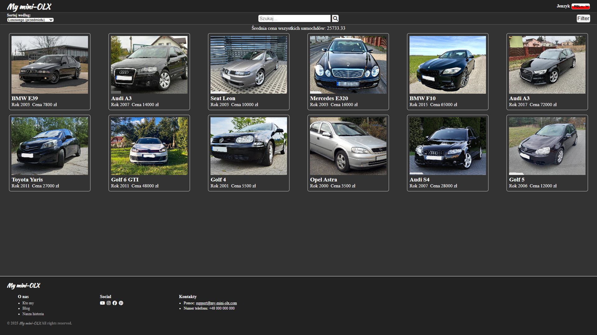

# 🛒 My mini-OLX  
**A small OLX-style web application built for practicing JavaScript, DOM manipulation, sorting, filtering, and multilingual UI.**

## 📌 About the project
My mini-OLX is a training project created to improve my JavaScript skills.  
The main idea of the app is to display a list of car advertisements and allow the user to:

- 🔎 Search by name  
- 🎛 Filter by price and production year  
- ↕ Sort items (random, cheapest, most expensive)  
- 🌍 Switch languages (Polish 🇵🇱 / Ukrainian 🇺🇦)  
- 📱 Open each advertisement on a separate page  
- 🖼 View the full image in a modal window  

This is my first larger JavaScript project where I practiced real-world logic, UI rendering, working with arrays, events, and state management.

---

## 🚀 Features
- **Dynamic rendering using JavaScript**
- **Sorting:** random, max price, min price  
- **Filtering:** year range + price range  
- **Search system**  
- **Two languages (PL/UA)**  
- **Modal image preview**  
- **LocalStorage integration for saving selected ad**
- **Responsive design**

---

## 🛠 Technologies
- HTML5  
- CSS3  
- Vanilla JavaScript (ES6+)  
- DOM 
- LocalStorage  

---

## 📂 Project structure

css/
style.css

js/
index.js
css_style_DOM.js

img/
images...

ad.html
index.html

---

## 📷 Preview

---

## 📚 Purpose
This project was built **only for learning**.  
My goal was to improve:

- JavaScript logic  
- DOM rendering  
- State management (filters, sorting, languages)  
- Clean code  
- UI and UX decisions  

This project helped me understand real structure and solve problems similar to professional development.

---

## © Author
Created by **[Pavlo555]**  
Project for learning JavaScript — 2025.